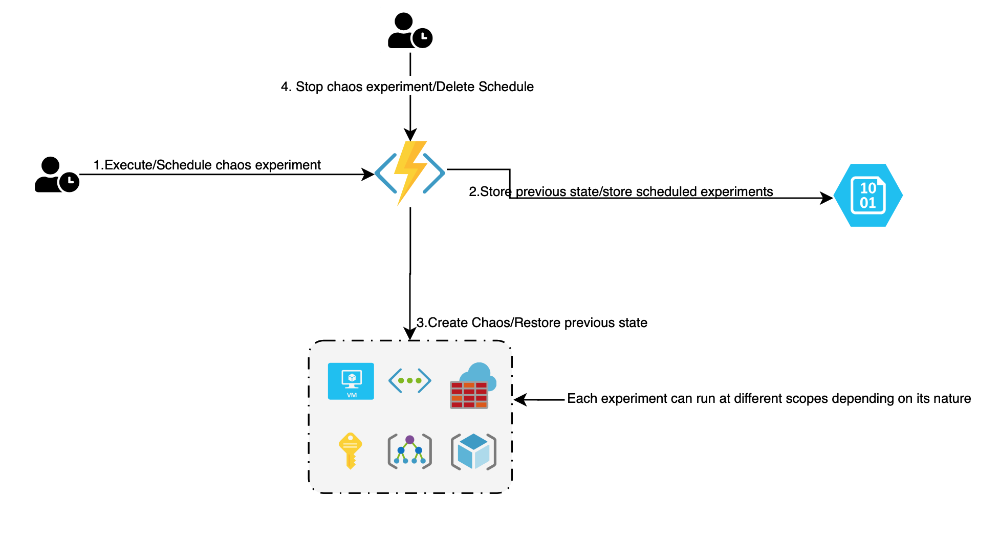

# cloud-chaos-typhoon :cyclone: :ocean: :zap: :cloud:

**Typoohn** is a **multi-cloud Chaos as a service** that can be used in several ways based on the maturity level of your system.  
This project is inspired to other chaos services and tools, the following are the goals of this project:

- Easy to deploy and to use
- Run chaos experiments based on real-world failures
- Multi-cloud
- Act at cloud services level
- Safe to use, stop and rollback experiments
- Promote chaos days into organizations

## HLD ( Azure example )

Internally the core of the typhoon API is pluggable so that the underlying storage, resources lookup and actions are done based on the cloud where it runs.  
The way how the APIs are exposed and run change for each cloud for example on Azure it will run on Azure Functions, in general as much as possible **typhoon** is serverless.  

## Real-worl scenarios

Please look here to find or suggest a real-world scenario.
