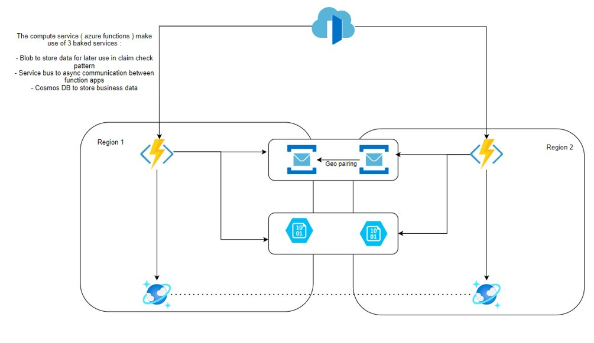

# Chaos experiments

This repo contains some fully automated chaos experiments to demonstrate the power of Chaos Engineering practice and apply it at cloud infrastructure level.

Chaos experiments will be applied on the architecture below :



The reference architecture is an event-driven system that uses claim check pattern and is deployed on two different Azure regions.  
Service Bus and Azure Storage Account are deployed in both the regions but the same endpoint is used on both the Function Apps, the switch to the service bus/storage account secondary region is supposed to be done at DNS level and not to an application level, accordingly to Azure documentation on failover of those two services.  
Azure Front Door will distribute the traffic on the primary region only when the system is in its steady state, when the normal state of the system is affected then front door should redirect traffic to the secondary region.  
The compute layer is serverless and built on Azure Functions, but a similar system can be built using other compute services like AKS.

## Steady state

Assuming that the reference event-driven system is a supply chain, the system is considered in its steady state if is able to create and process new orders.
This is obviously a simplified view of a supply chain, just to demonstrate the power of Chaos Engineering practices and how to start implementing them.  
The steady state will be checked through custom Azure application insights business metrics.

## Experiment number 1

In this first experiment consists on simulate Azure Function Apps failure on the primary region.  
An entry level experiment that helps to define the steady state and understand how to check the steady state.  
This experiment should work thanks to Azure Front Door that switch the traffic to the secondary region.  

## Experiment number 2

In this first experiment consists on simulate Azure Storage Account failure on the primary region.  
As clear into the high level architecture our system use claim check pattern massively, so if storage account does not work and the system is not reactive, failures will start really soon.
To handle this scenario the system use a circuit breaker pattern that temporarily use cosmos db instead of storage account to store blob data.  
The function that consume the event will first check if blob data are present on the storage account, if not then will retry to look on the cosmos account.  

## How to execute the chaos experiments

### Pre-requisites

Chaoos toolkit CLI >= 1.9.0
Azure Powershell >= 5.7.0

### Login into Azure

Login into azure using Connect-AzAccount cmdlet, for now this is the unique option supported.
Later managed identities and service principals can be added as needed.

### Deploy infrastructure

``` bash
cd templates
pwsh
./deploy.ps1
```

Check the output that will suggest you some env variables to set for the next step.

### Setup environment variables

Set up the env variables as suggested as output on the previous step.

### Wait for the system to be ready

Wait for azure front door to be set and ready, concat the azure front door frontend url with /api/SendOrder and do a test rest request ( a GET is fine ).
Explains this better in future.  

### Run the chaos experiment

``` bash
cd experiments/001 ( or 002)
export PYTHONPATH=`pwd`  
chaos run experiment.json
```
